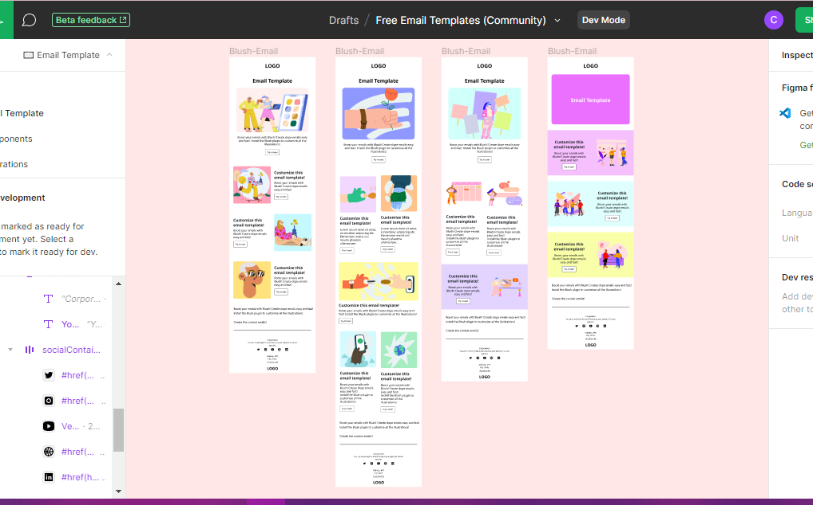
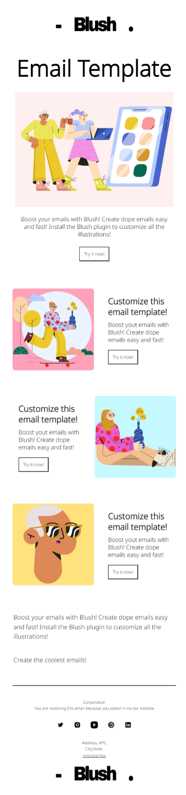
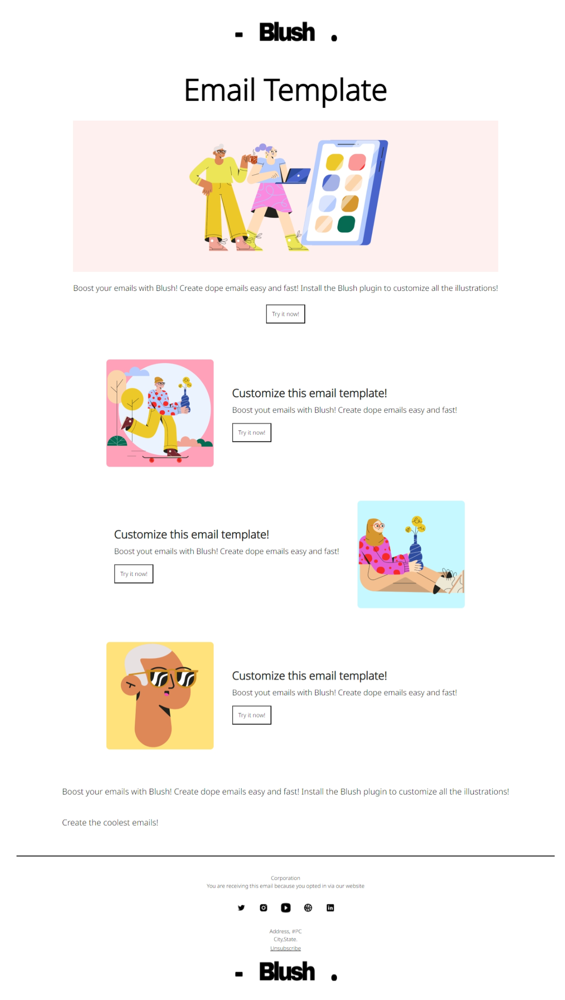
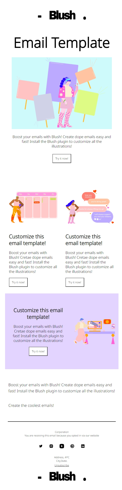

# Examples of newsletter development based on free figma templates

## Description
### mobile-first design
### In cases of web layout we would use semantic tags, divs, flexbox and grids; but in the case of email layout we use tables and style attributes due to the limitations and lack of compatibility of many email clients.

## Figma templates

## Layout

