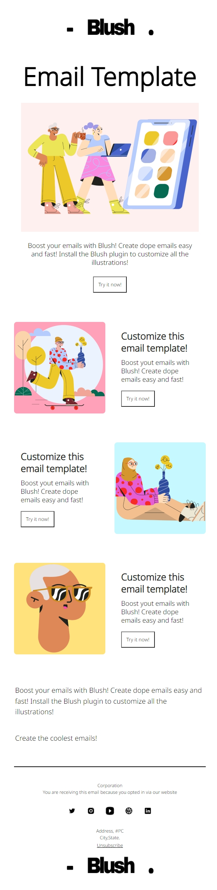

# Examples of newsletter development based on free figma templates

## Description
### mobile-first design
### Use of html tables and style attribute when developing a newsletter due to limitations and lack of CSS support in many email clients

## Figma templates

## Layout

